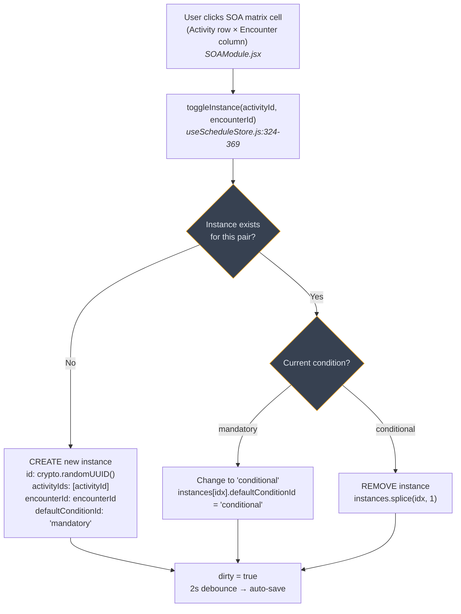
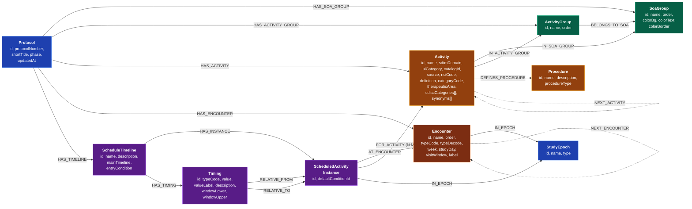
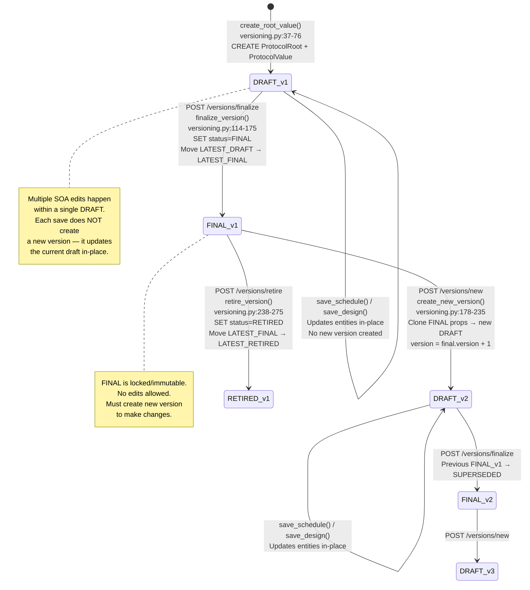
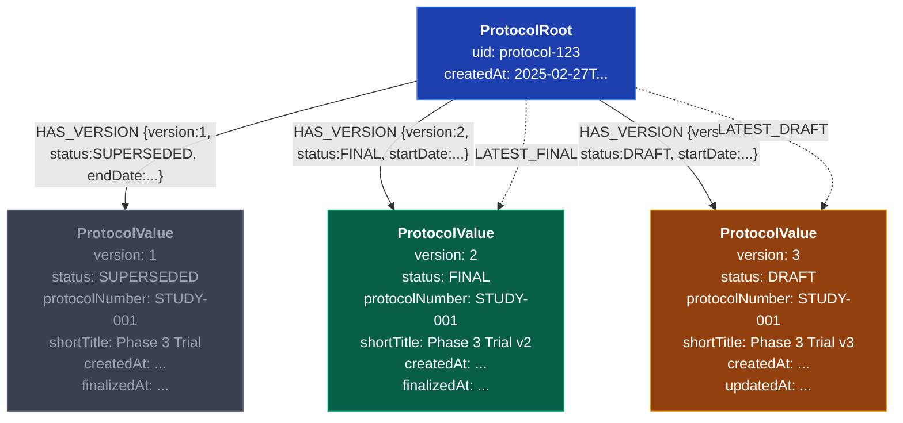
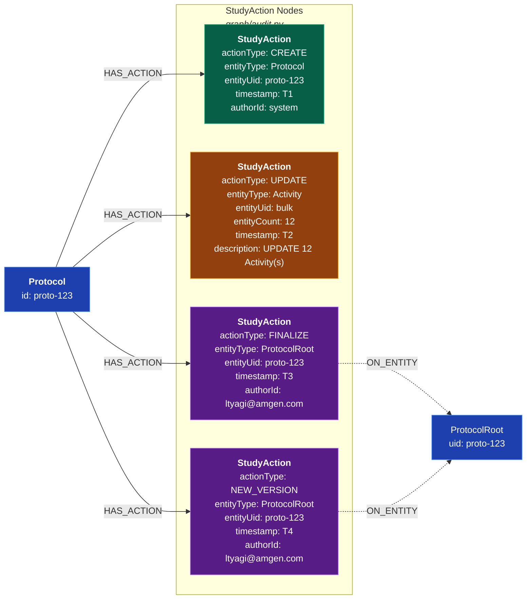
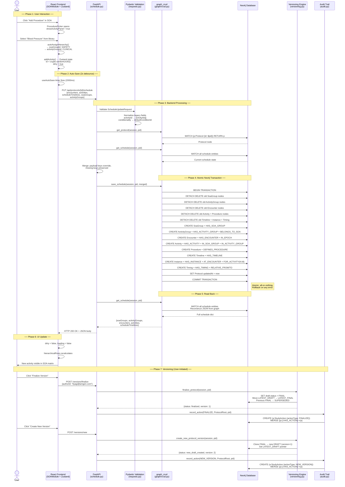
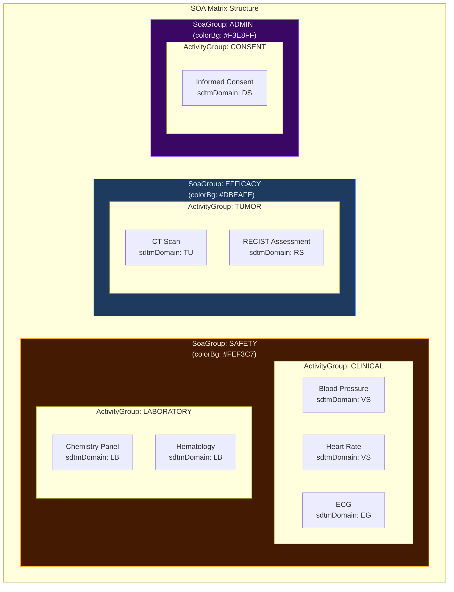

# TrialForge SOA Data Flow — Mermaid Diagrams

> **Generated from codebase analysis — no hardcoded values.**
> Every function name, Cypher query, node label, relationship type, and data field
> is traced directly from the source files listed below each diagram.

---

## Diagram 1: End-to-End Flow — User Adds an Activity/Procedure in SOA

```mermaid
flowchart TD
    subgraph FRONTEND["Frontend (React + Zustand)"]
        A["User clicks 'Add Procedure'<br/><i>SOAModule.jsx:649-662</i><br/>sets showActivityPanel: true"]
        B["ProcedurePicker renders<br/><i>SOA/ProcedurePicker.jsx</i><br/>Browse CDISC library or custom"]
        C["User selects procedure &amp; clicks Add<br/><i>ProcedurePicker.jsx:235-252</i><br/>handleAddProcedure(proc)"]
        D["autoAssignHierarchy(activity, soaHierarchy)<br/><i>useScheduleStore.js:8-34</i><br/>Assigns soaGroupId + activityGroupId<br/>Rules: nameOverrides → byCategoryAndDomain → default SAFETY"]
        E["addActivity(enriched)<br/><i>useScheduleStore.js:233-243</i><br/>id = crypto.randomUUID()<br/>activities: [...state.activities, newActivity]<br/><b>dirty = true</b>"]
        F["useAutoSave detects dirty=true<br/><i>useAutoSave.js:17-24</i><br/>2000ms debounce timer starts"]
        G["Timer fires → saveSchedule(protocolId)<br/><i>useScheduleStore.js:375-391</i>"]
        H["scheduleApi.saveSchedule(protocolId, data)<br/><i>api/schedule.js:19-22</i><br/><b>PUT /api/protocols/{'{'}id{'}'}/schedule</b><br/>Body: {'{'}encounters, activities,<br/>scheduleTimelines, soaGroups, activityGroups{'}'}"]
    end

    subgraph BACKEND["Backend (FastAPI + Neo4j)"]
        I["FastAPI route: update_schedule()<br/><i>routers/schedule.py:39-77</i><br/>Pydantic: ScheduleUpdateRequest"]
        J["Pydantic validation<br/><i>models/requests.py</i><br/>• ActivityRequest validates all fields<br/>• ScheduleInstanceRequest normalizes:<br/>&nbsp;&nbsp;activityId → activityIds<br/>&nbsp;&nbsp;conditionality → defaultConditionId"]
        K["graph_crud.get_protocol(session, pid)<br/><i>graph/crud.py</i><br/>404 if not found"]
        L["body.model_dump(exclude_none=True)<br/>Only keys user provided"]
        M["graph_crud.get_schedule(session, pid)<br/><i>graph/crud.py:982-1112</i><br/>Read current schedule from Neo4j"]
        N["Merge semantics<br/><i>schedule.py:64-69</i><br/>for key in SCHEDULE_KEYS:<br/>&nbsp;&nbsp;if key in payload → use new<br/>&nbsp;&nbsp;elif key in current → keep existing"]
        O["graph_crud.save_schedule(session, pid, merged)<br/><i>graph/crud.py:464-810</i><br/><b>Neo4j Transaction</b>"]
        P["graph_crud.get_schedule(session, pid)<br/>Read back saved state"]
        Q["Return JSON response → 200 OK"]
    end

    subgraph NEO4J_TX["Neo4j Transaction (save_schedule)"]
        O1["tx = await session.begin_transaction()"]
        O2["DELETE old: SoaGroup, ActivityGroup,<br/>Encounter, Activity+Procedure,<br/>ScheduleTimeline+Instance+Timing<br/><i>DETACH DELETE per entity type</i>"]
        O3["CREATE SoaGroup nodes<br/>+ Protocol-[:HAS_SOA_GROUP]->SoaGroup"]
        O4["CREATE ActivityGroup nodes<br/>+ Protocol-[:HAS_ACTIVITY_GROUP]->ActivityGroup<br/>+ ActivityGroup-[:BELONGS_TO_SOA]->SoaGroup"]
        O5["CREATE Encounter nodes<br/>+ Protocol-[:HAS_ENCOUNTER]->Encounter<br/>+ Encounter-[:IN_EPOCH]->StudyEpoch<br/>+ Encounter-[:NEXT_ENCOUNTER]->Encounter"]
        O6["CREATE Activity nodes<br/>+ Protocol-[:HAS_ACTIVITY]->Activity<br/>+ Activity-[:IN_SOA_GROUP]->SoaGroup<br/>+ Activity-[:IN_ACTIVITY_GROUP]->ActivityGroup<br/>+ Activity-[:DEFINES_PROCEDURE]->Procedure"]
        O7["CREATE ScheduleTimeline nodes<br/>+ Protocol-[:HAS_TIMELINE]->Timeline"]
        O8["CREATE ScheduledActivityInstance nodes<br/>+ Timeline-[:HAS_INSTANCE]->Instance<br/>+ Instance-[:AT_ENCOUNTER]->Encounter<br/>+ Instance-[:FOR_ACTIVITY]->Activity (N:M)<br/>+ Instance-[:IN_EPOCH]->StudyEpoch"]
        O9["CREATE Timing nodes<br/>+ Timeline-[:HAS_TIMING]->Timing<br/>+ Timing-[:RELATIVE_FROM]->Instance<br/>+ Timing-[:RELATIVE_TO]->Instance"]
        O10["SET Protocol.updatedAt = now"]
        O11["await tx.commit()<br/><i>or tx.rollback() on error</i>"]
    end

    subgraph RESPONSE["Response Path"]
        R1["Frontend receives 200 OK<br/><i>useScheduleStore.js:386</i><br/>dirty = false, loading = false"]
        R2["hierarchicalRows memo recalculates<br/><i>SOAModule.jsx:212-304</i><br/>Groups activities by SOA→ActivityGroup"]
        R3["New activity visible in SOA matrix<br/>under correct group hierarchy"]
    end

    A --> B --> C --> D --> E --> F --> G --> H
    H -->|HTTP PUT| I
    I --> J --> K --> L --> M --> N --> O
    O --> O1 --> O2 --> O3 --> O4 --> O5 --> O6 --> O7 --> O8 --> O9 --> O10 --> O11
    O11 --> P --> Q
    Q -->|HTTP 200| R1 --> R2 --> R3

    style FRONTEND fill:#1e293b,stroke:#3b82f6,color:#e2e8f0
    style BACKEND fill:#1e293b,stroke:#10b981,color:#e2e8f0
    style NEO4J_TX fill:#1e293b,stroke:#f59e0b,color:#e2e8f0
    style RESPONSE fill:#1e293b,stroke:#8b5cf6,color:#e2e8f0
```

---

## Diagram 2: SOA Matrix Toggle (Checking/Unchecking a Cell)

**Three-state cycle per cell**: Empty → ✓ Mandatory → ◐ Conditional → Empty

---

## Diagram 3: Neo4j Graph Schema — SOA Entity Relationships

**Key**: The `ScheduledActivityInstance` is the **junction node** that forms the SOA matrix.
Each instance links an Activity to an Encounter via `FOR_ACTIVITY` and `AT_ENCOUNTER` relationships.

---

## Diagram 4: Versioning Lifecycle — Root-Value Pattern

---

## Diagram 5: Neo4j Version Graph Structure

**Pointer relationships** (dashed) enable O(1) lookups:
- `LATEST_DRAFT` → current editable version
- `LATEST_FINAL` → latest approved version
- `LATEST_RETIRED` → latest deprecated version (not shown)

---

## Diagram 6: Audit Trail — What Gets Recorded

**Action types** (`audit.py:21-28`):
| Type | When |
|------|------|
| `CREATE` | New protocol/entity created |
| `UPDATE` | Entity properties changed (or bulk save) |
| `DELETE` | Entity removed |
| `FINALIZE` | DRAFT → FINAL transition |
| `NEW_VERSION` | New DRAFT created from FINAL |
| `ROLLBACK` | Changes reverted |
| `RETIRE` | FINAL → RETIRED |

**Snapshots** stored as JSON strings on StudyAction node:
- `beforeSnapshot` — state before change
- `afterSnapshot` — state after change

---

## Diagram 7: Complete Data Journey — SOA Save with Versioning + Audit

---

## Diagram 8: SOA Hierarchy — How Activities Are Organized

**Auto-assignment logic** (`useScheduleStore.js:8-34`):
1. Check `nameOverrides` → exact name match (e.g., "Informed Consent" → CONSENT)
2. Check `byCategoryAndDomain[category].domainMap[domain]` → category+domain rules
3. Fallback → `defaultActivityGroup[soaGroupId]`
4. Ultimate fallback → `soaGroupId: 'SAFETY'`

---

## Diagram 9: save_schedule() Internal Transaction Detail

```mermaid
flowchart TD
    START["save_schedule(session, pid, data)<br/><i>graph/crud.py:464</i>"]
    TX["tx = await session.begin_transaction()<br/><i>crud.py:467</i>"]

    subgraph DELETE["Phase 1: Delete All Existing (per type)"]
        D1["MATCH (:Protocol {'{'}id:$pid{'}'})
        -[:HAS_SOA_GROUP]->(g:SoaGroup)
        DETACH DELETE g"]
        D2["MATCH (:Protocol {'{'}id:$pid{'}'})
        -[:HAS_ACTIVITY_GROUP]->(g:ActivityGroup)
        DETACH DELETE g"]
        D3["MATCH (:Protocol {'{'}id:$pid{'}'})
        -[:HAS_ENCOUNTER]->(e:Encounter)
        DETACH DELETE e"]
        D4["MATCH (:Protocol {'{'}id:$pid{'}'})
        -[:HAS_ACTIVITY]->(a:Activity)
        OPTIONAL MATCH (a)-[:DEFINES_PROCEDURE]->(pr:Procedure)
        DETACH DELETE pr, a"]
        D5["MATCH (:Protocol {'{'}id:$pid{'}'})
        -[:HAS_TIMELINE]->(tl:ScheduleTimeline)
        OPTIONAL MATCH (tl)-[:HAS_INSTANCE]->(i)
        OPTIONAL MATCH (tl)-[:HAS_TIMING]->(t)
        DETACH DELETE t, i, tl"]
    end

    subgraph CREATE["Phase 2: Recreate From Merged Data"]
        C1["for sg in data['soaGroups']:<br/>CREATE (g:SoaGroup {'{'}...props{'}'})<br/>CREATE (p)-[:HAS_SOA_GROUP]->(g)"]
        C2["for ag in data['activityGroups']:<br/>CREATE (g:ActivityGroup {'{'}...props{'}'})<br/>CREATE (p)-[:HAS_ACTIVITY_GROUP]->(g)<br/>MATCH (sg:SoaGroup {'{'}id: ag.soaGroupId{'}'})<br/>CREATE (g)-[:BELONGS_TO_SOA]->(sg)"]
        C3["for enc in data['encounters']:<br/>CREATE (e:Encounter {'{'}...props{'}'})<br/>CREATE (p)-[:HAS_ENCOUNTER]->(e)<br/>[+ IN_EPOCH, NEXT_ENCOUNTER if applicable]"]
        C4["for act in data['activities']:<br/>CREATE (a:Activity {'{'}...props{'}'})<br/>CREATE (p)-[:HAS_ACTIVITY]->(a)<br/>[+ IN_SOA_GROUP, IN_ACTIVITY_GROUP,<br/>DEFINES_PROCEDURE, NEXT_ACTIVITY]"]
        C5["for tl in data['scheduleTimelines']:<br/>CREATE (tl:ScheduleTimeline {'{'}...{'}'})<br/>CREATE (p)-[:HAS_TIMELINE]->(tl)"]
        C6["for inst in tl['instances']:<br/>CREATE (i:ScheduledActivityInstance {'{'}...{'}'})<br/>CREATE (tl)-[:HAS_INSTANCE]->(i)<br/>CREATE (i)-[:AT_ENCOUNTER]->(enc)<br/>for actId in inst['activityIds']:<br/>&nbsp;&nbsp;CREATE (i)-[:FOR_ACTIVITY]->(act)"]
        C7["for tim in tl['timings']:<br/>CREATE (t:Timing {'{'}...{'}'})<br/>CREATE (tl)-[:HAS_TIMING]->(t)<br/>[+ RELATIVE_FROM, RELATIVE_TO]"]
    end

    TS["SET Protocol.updatedAt = $now"]
    COMMIT["await tx.commit()"]
    ERR["await tx.rollback()<br/>raise"]

    START --> TX --> D1 --> D2 --> D3 --> D4 --> D5
    D5 --> C1 --> C2 --> C3 --> C4 --> C5 --> C6 --> C7
    C7 --> TS --> COMMIT
    TX -->|Exception| ERR

    style DELETE fill:#1c1917,stroke:#ef4444,color:#fca5a5
    style CREATE fill:#1c1917,stroke:#22c55e,color:#bbf7d0
```

---

## Self-Critique & Architectural Gaps

### What the code actually does well:
1. **Atomic transactions** — `save_schedule` is all-or-nothing; a failed Cypher rolls back everything
2. **Merge semantics** — Only keys sent in the PUT body are replaced; others preserved
3. **N:M junction pattern** — `ScheduledActivityInstance` properly models the SOA matrix via graph relationships, not arrays
4. **Legacy normalization** — Pydantic validators handle old `activityId`/`conditionality` → canonical form
5. **Auto-hierarchy** — Frontend smartly assigns SOA groups based on rules before sending to backend

### Honest gaps found in the code:

| Gap | Location | Impact |
|-----|----------|--------|
| **SOA not versioned per-version** | `save_schedule` writes to Protocol's direct children, NOT to ProtocolValue | Reconstructing SOA at version N is not possible — versions only capture Protocol metadata (protocolNumber, shortTitle, etc.), not the full entity graph |
| **Delete-and-recreate strategy** | `save_schedule` DETACH DELETEs all nodes then recreates | Every save destroys and recreates all graph nodes, losing Neo4j internal IDs. Fine for correctness, but means every auto-save (2s debounce) churns all SOA nodes |
| **No audit on schedule save** | `save_schedule` in crud.py does NOT call `record_action()` or `record_bulk_action()` | Schedule changes are silently saved without audit trail entries. Audit is only called from versioning actions (finalize, new_version). Design changes also lack automatic audit recording |
| **bulk_version_entities exists but unused** | `versioning.py:484-558` has `bulk_version_entities()` | This function exists to version child entities but is not called from `save_schedule` or `save_design`. It's infrastructure waiting to be wired up |
| **No concurrent edit protection** | No optimistic locking or ETag | Two users editing the same protocol's SOA simultaneously could overwrite each other — last writer wins |

---

## Source File Index

| File | Purpose | Key Lines |
|------|---------|-----------|
| `frontend/src/components/modules/SOAModule.jsx` | SOA matrix UI, activity panel | 212-304 (hierarchy), 649-662 (add button) |
| `frontend/src/components/modules/SOA/ProcedurePicker.jsx` | CDISC activity browser | 235-252 (handleAddProcedure) |
| `frontend/src/store/useScheduleStore.js` | Zustand schedule state | 8-34 (autoAssign), 233-243 (addActivity), 324-369 (toggleInstance), 375-391 (saveSchedule) |
| `frontend/src/hooks/useAutoSave.js` | 2s debounce auto-save | 17-24 (timer logic) |
| `frontend/src/api/schedule.js` | HTTP client for schedule | 19-22 (PUT call) |
| `backend/app/routers/schedule.py` | FastAPI schedule endpoints | 29-36 (GET), 39-77 (PUT) |
| `backend/app/models/requests.py` | Pydantic request models | 30-62 (ScheduleInstance), 104-129 (Activity), 152-161 (ScheduleUpdate) |
| `backend/app/graph/crud.py` | Neo4j CRUD operations | 464-810 (save_schedule), 982-1112 (get_schedule) |
| `backend/app/graph/versioning.py` | Root-Value version engine | 37-76 (create), 114-175 (finalize), 178-235 (new version) |
| `backend/app/graph/audit.py` | StudyAction audit trail | 31-106 (record_action), 109-146 (record_bulk_action) |
| `backend/app/routers/versions.py` | Version lifecycle API | 35-53 (GET history), 100-127 (finalize), 130-156 (new) |
| `backend/app/graph/schema.py` | Neo4j constraints & indexes | 11-50 (uniqueness), 53-71 (indexes) |
